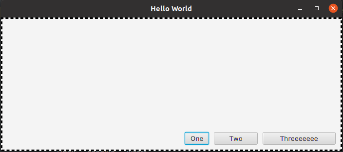
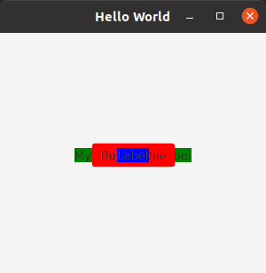
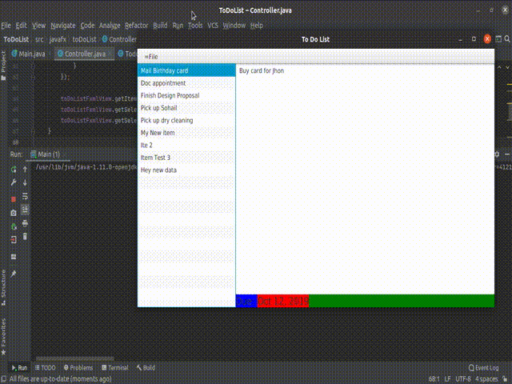

# JavaFX

>>Examples for all JavaFX components. Almost everyting you will need to build a GUI is here for your reference. 

---

#### Note

- Allot of the files have comented out code, this is because I could not implement differnt projects for all views and components of JavaFX.
They are all working, pls un-comment this and comment the current parts and run the program to view. 
- If the code is not working, pls confirm that you have the JavaFX libraries in your IDE. If not then pls import them to the project, or add them to the IDE.

---
[1. Hello World](01.Hello-World-FX/src/sample)

This is a basic program 'Hello World'. 

---

[2. GridPlane & HBox](02.GridPlane-&-HBox/src/sample)

This will show an example of GridPlane and HBox. To run the GridPlane pls un-comment the code and comment the HBox one. 

---

[03. BorderPane Layout](03.BorderPane-Layout/src/sample)

Here we can see on example of a BorderPane. The different sections are seperated by lines as seen. We can also nest one view/pane in another. For the BorderPane, the center will take up any left over space. 

---

[04. FlowPane TilePane StackPane](04.FlowPane-TilePane-StackPane/src/sample)

Pls edit the commenting to view different JavFX components. Here you can also see which component will cover which one. Knowing this helps to have a good understanding of JavaFX and how it works. 

---

[05. Button & Image](05.Button-&-Image/src/sample)

The Image here is not working, and is commented out. This is due to my own PC though and it should work on another IDE. Pls do try and run the application with this part not commented.

---

[06. All Button Font Styling All Other Controls](06.All-Buttons-Font-Styling-All-Other-Controls/src/sample)

This application shows us the use of: Button, Label, Changing text style, ToggleGroup, RadioButton, CheckBox, ToggleButton, TextField, PasswordField, ChoiceBox, Slider, Spinner, ColorPicker, DatePicker, Accordion.

---

[07. Event Handelers](07.Event-Handelers/src/sample)

Whenever we click a button or select something we can trigger an event in the controller. This project will show you an example of the these evant handelers. 

---

[08. JavaFX CSS](08.JavaFX-CSS/src/sample)

This project will show you a small way in which you could use CSS in your GUI application. You can also see how a link is added. 

---

[09. Scene builder](09-Scene-builder/src/sample)

This is am example of what a .fxml file will look like if built with Scene Builder. The Scene Builder adds allot of not needed code and could be confusing at times. 

---

[10 Todo List](10-To-Do-List/src/javafx/toDoList)

